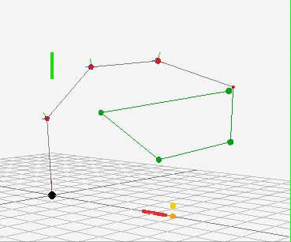

# Promenad
An purely procedural animation system that can walk and hold hands. Created in the spring of 2021 as the specialization course at [The Game Assembly](https://www.thegameassembly.com/).


 
## Feature highlights

Inverse kinematics animation system constrained by hinge joints.



## Controls

### World cursor

| Input | Desciption |
| ---   | --- |
| ⬅️/➡️ | Move in world cursor along the X-axis |
| ⬆️/⬇️ | Move in world cursor along the Y-axis |
| Shift + ⬅️/➡️ | Move in world cursor along the Z-axis |
| Space | Set end effector goal of one specific (hard coded) limb |

### Actors
| Input | Desciption |
| ---   | --- |
| WASD  | Move actor #1 (if available) |
| IJKL  | Move actor #2 (if available) |
| H | Toggle hand holding |

### Playback

| Input | Desciption |
| ---   | --- |
| P | Toggle pause |
| R/F (while paused) | Rewind / Replay one simulation step |
| Shift + R/F (while paused) | Rewind / Replay ten simulation steps |
| R (if not paused)  | Rewind up to 1024 simulation steps)
| N | Take one simulation step forward|


## How to build and run

Full rebuild:

```bash
make clean all
```

Run application (while developing):

```bash
make run
```

Run test suite:

```bash
make check
```

[](https://github.com/jordgubben/promenad/actions/workflows/build.yml)


## Dependencies

 - [Catch 2](https://github.com/catchorg/Catch2/)
 - [Raylib](https://www.raylib.com/)

## Folders

  - `src/` – Our code.
  - `res/` – Models, textures, config-files etc.
  - `bin/` – Where the executables go.
  - `tmp/` – Build intermediates, logs etc.
