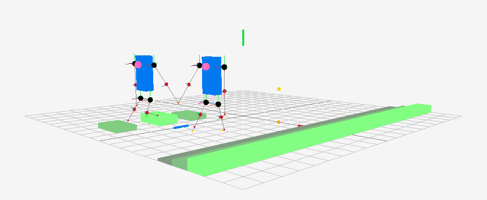

# Promenad
An purely procedural animation system that can walkn and hold hands. Created in the spring of 2021 as the specialization course at [The Game Assembly](https://www.thegameassembly.com/).



## How to build and run

Full rebuild:

```bash
make clean all
```

Run application (while developing):

```bash
make run
```

Run test suite:

```bash
make check
```

[](https://github.com/jordgubben/promenad/actions/workflows/build.yml)


## Dependencies

 - [Catch 2](https://github.com/catchorg/Catch2/)
 - [Raylib](https://www.raylib.com/)

## Folders

  - `src/` – Our code.
  - `res/` – Models, textures, config-files etc.
  - `bin/` – Where the executables go.
  - `tmp/` – Build intermediates, logs etc.
